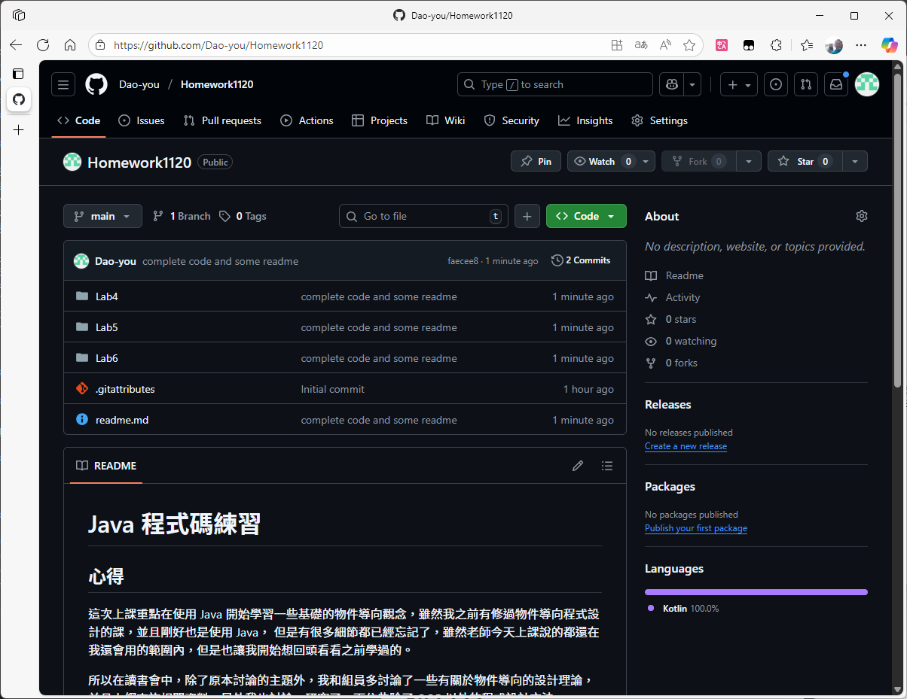
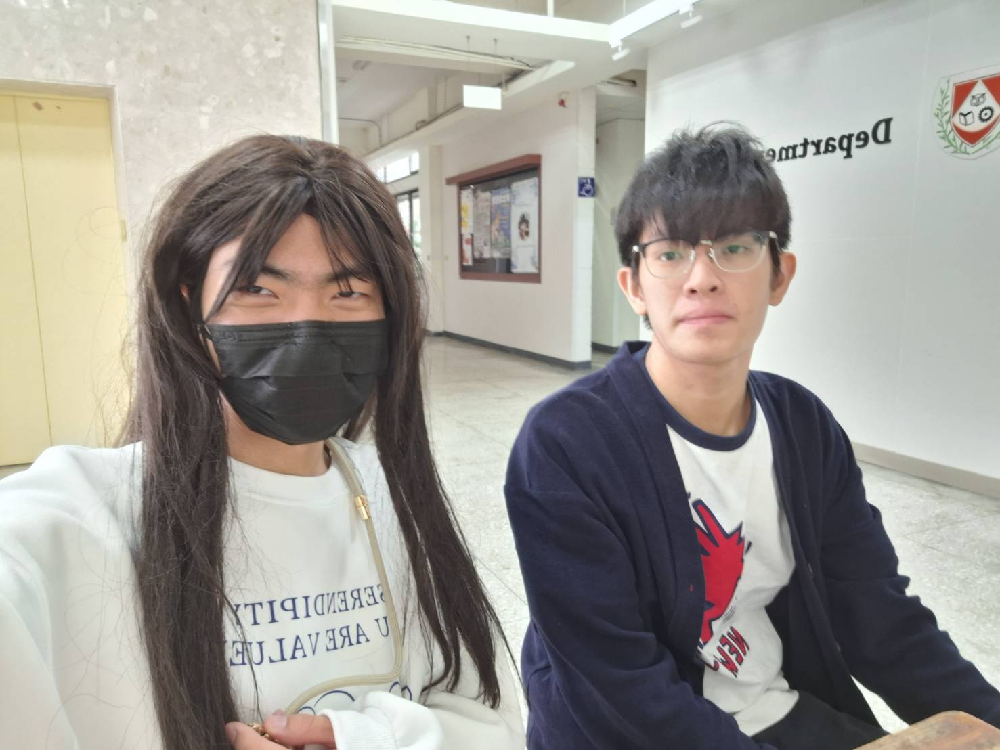

# Java 程式碼練習

## 心得

這次上課重點在使用 Java 開始學習一些基礎的物件導向觀念，雖然我之前有修過物件導向程式設計的課，並且剛好也是使用 Java， 但是有很多細節都已經忘記了，雖然老師今天上課說的都還在我還會用的範圍內，但是也讓我開始想回頭看看之前學過的。

所以在讀書會中，除了原本討論的主題外，我和組員多討論了一些有關於物件導向的設計理論，並且上網查詢相關資料。另外我也討論、研究了一下依些除了 OOP 以外的程式設計方法。

## Github

### 網址：
[https://github.com/Dao-you/JavaHomework1113](https://github.com/Dao-you/JavaHomework1113)

### 截圖：

# 讀書會

* 組員：方宇澤
* 討論時間：2025/11/07 15:00~16:00
* 地點：電腦教室(做完實驗之後討論)
* 討論主題：程式碼可讀性最佳化、Kotlin 基本、enum class 的使用

